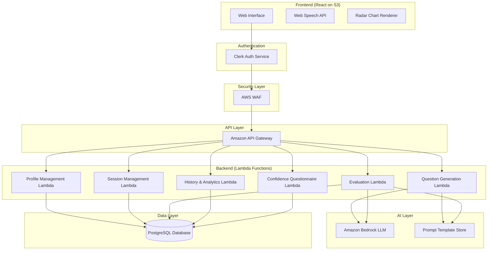

# Design Document: AI Interview Coach

## Overview

The AI Interview Coach is a cloud-native, serverless web application that provides structured, multi-dimensional interview preparation powered by Amazon Bedrock LLMs. The system generates company-specific interview questions using few-shot prompting and evaluates user responses across four rubric-based dimensions (Content Relevance, Structure/Organization, Technical Accuracy, Communication Clarity), each scored 1–5. Results are visualized via radar charts for intuitive performance understanding.

The architecture follows a layered serverless pattern: React frontend (hosted on S3) → Clerk Authentication → AWS WAF → Amazon API Gateway → AWS Lambda (Node.js) → Amazon Bedrock + PostgreSQL. This separation ensures scalability, security, and clear responsibility boundaries.

Key design goals:
- **Reproducibility**: Fixed prompt templates, versioned configurations, low temperature inference, and structured JSON output ensure consistent AI evaluation across users and sessions.
- **Interpretable Feedback**: Multi-dimensional scoring with radar chart visualization allows users to quickly identify strengths and weaknesses.
- **Scalability**: Serverless Lambda functions scale automatically with demand.
- **Security**: AWS WAF filtering, Clerk-managed authentication, and API Gateway authorization protect all endpoints.

## Architecture

### High-Level Architecture Diagram



### Request Flow

1. User interacts with the React frontend hosted on S3.
2. Clerk handles authentication and attaches JWT tokens to requests.
3. Requests pass through AWS WAF for security filtering (SQL injection, XSS, rate limiting).
4. API Gateway validates the JWT, routes to the appropriate Lambda function.
5. Lambda functions execute business logic, calling Bedrock for AI operations or PostgreSQL for data persistence.
6. Responses flow back through the same path to the frontend.

### Design Decisions

| Decision | Choice | Rationale |
|----------|--------|-----------|
| Auth provider | Clerk | Managed auth reduces custom security code; supports JWT natively with API Gateway |
| AI service | Amazon Bedrock | Managed LLM service within AWS ecosystem; supports low-temperature settings and structured output |
| Database | PostgreSQL | Relational model fits structured session/score data; strong support for analytical queries |
| Frontend hosting | S3 + CloudFront | Static hosting with CDN for low latency; separates frontend deployment from backend |
| Backend compute | Lambda | Pay-per-use; auto-scaling; no infrastructure management |
| Prompt storage | Versioned config files in Lambda deployment | Ensures reproducibility; version tracked per session |

## Components and Interfaces

### Frontend Components

| Component | Responsibility |
|-----------|---------------|
| `AuthProvider` | Wraps app with Clerk authentication context; manages login/logout flows |
| `ProfileForm` | Collects and submits user profile (role, skills, experience) |
| `CompanySelector` | Displays company/domain list; stores selection for session context |
| `InterviewSession` | Manages active interview: displays questions, accepts responses |
| `TextInput` | Text area for typed interview responses |
| `VoiceInput` | Web Speech API integration for voice-to-text transcription |
| `EvaluationDisplay` | Shows per-question dimension scores and textual feedback |
| `RadarChart` | Renders multi-axis radar chart from dimension scores |
| `SessionHistory` | Lists past sessions with summary scores; enables drill-down |
| `ProgressDashboard` | Displays trend charts, radar overlays, confidence scores |
| `ConfidenceQuestionnaire` | Presents Likert scale statements; collects pre/post responses |

### Backend Lambda Functions

| Function | Endpoint | Responsibility |
|----------|----------|---------------|
| `ProfileManagement` | `POST/GET/PUT /api/profile` | CRUD operations for user profile data |
| `SessionManagement` | `POST /api/sessions`, `GET /api/sessions/:id` | Create sessions, store session context (company, domain) |
| `QuestionGeneration` | `POST /api/sessions/:id/questions` | Build prompt with profile + company context + few-shot examples; call Bedrock; return question |
| `ResponseEvaluation` | `POST /api/sessions/:id/evaluate` | Build evaluation prompt with rubric; call Bedrock; parse JSON response; calculate overall score; store |
| `SessionHistory` | `GET /api/sessions`, `GET /api/sessions/:id/detail` | Retrieve session list and detailed per-question feedback |
| `ConfidenceQuestionnaire` | `POST /api/sessions/:id/confidence` | Store pre/post questionnaire responses; compute confidence improvement |
| `ProgressAnalytics` | `GET /api/analytics/progress` | Aggregate scores across sessions; compute trends |

### API Interface Contracts

#### Question Generation Request
```json
{
  "sessionId": "uuid",
  "questionIndex": 1,
  "questionType": "technical" | "behavioral"
}
```

#### Question Generation Response
```json
{
  "questionId": "uuid",
  "questionText": "string",
  "questionType": "technical" | "behavioral",
  "difficulty": "beginner" | "intermediate" | "advanced"
}
```

#### Evaluation Request
```json
{
  "sessionId": "uuid",
  "questionId": "uuid",
  "responseText": "string"
}
```

#### Evaluation Response
```json
{
  "evaluationId": "uuid",
  "scores": {
    "contentRelevance": 1-5,
    "structureOrganization": 1-5,
    "technicalAccuracy": 1-5,
    "communicationClarity": 1-5
  },
  "overallScore": 1.0-5.0,
  "feedback": {
    "contentRelevance": { "text": "string", "suggestions": ["string"] },
    "structureOrganization": { "text": "string", "suggestions": ["string"] },
    "technicalAccuracy": { "text": "string", "suggestions": ["string"] },
    "communicationClarity": { "text": "string", "suggestions": ["string"] }
  }
}
```

#### Confidence Questionnaire Request
```json
{
  "sessionId": "uuid",
  "type": "pre" | "post",
  "responses": [
    { "statementIndex": 1, "score": 1-5 },
    { "statementIndex": 2, "score": 1-5 },
    { "statementIndex": 3, "score": 1-5 },
    { "statementIndex": 4, "score": 1-5 }
  ]
}
```

### Prompt Template Structure

```
SYSTEM: You are an expert interviewer for {company} conducting a {questionType} interview 
for the role of {targetRole}. The candidate has {yearsExperience} years of experience 
with skills in: {skillsList}.

FEW-SHOT EXAMPLES:
Q: {exampleQuestion1}
Q: {exampleQuestion2}

INSTRUCTIONS: Generate one {questionType} interview question that tests the candidate's 
{relevantSkill} knowledge at {difficultyLevel} level. Return ONLY the question text.
```

```
SYSTEM: You are an expert interview evaluator. Evaluate the following interview response 
using the rubric below. Return a JSON object with scores (1-5) and textual feedback for 
each dimension.

RUBRIC:
- Content Relevance (1-5): [level definitions]
- Structure and Organization (1-5): [level definitions]  
- Technical Accuracy (1-5): [level definitions]
- Communication Clarity (1-5): [level definitions]

QUESTION: {questionText}
RESPONSE: {userResponse}

OUTPUT FORMAT: {"scores": {...}, "feedback": {...}}
```

## Data Models

### Entity Relationship Diagram

```mermaid
erDiagram
    USER {
        uuid id PK
        string clerk_user_id UK
        string email
        string target_role
        text skills
        integer years_experience
        timestamp created_at
        timestamp updated_at
    }

    SESSION {
        uuid id PK
        uuid user_id FK
        string company
        string domain
        string status
        float overall_score
        string prompt_template_version
        timestamp started_at
        timestamp completed_at
    }

    QUESTION {
        uuid id PK
        uuid session_id FK
        integer question_index
        string question_type
        text question_text
        string difficulty
        timestamp generated_at
    }

    RESPONSE {
        uuid id PK
        uuid question_id FK
        text response_text
        string input_method
        timestamp submitted_at
    }

    EVALUATION {
        uuid id PK
        uuid response_id FK
        integer content_relevance
        integer structure_organization
        integer technical_accuracy
        integer communication_clarity
        float overall_score
        jsonb feedback
        string prompt_template_version
        timestamp evaluated_at
    }

    CONFIDENCE_QUESTIONNAIRE {
        uuid id PK
        uuid session_id FK
        string type
        jsonb responses
        float average_score
        timestamp submitted_at
    }

    PROMPT_TEMPLATE {
        uuid id PK
        string name
        string version
        text template_text
        string purpose
        float temperature
        timestamp created_at
    }

    USER ||--o{ SESSION : "has many"
    SESSION ||--o{ QUESTION : "contains"
    QUESTION ||--|| RESPONSE : "has one"
    RESPONSE ||--|| EVALUATION : "has one"
    SESSION ||--o{ CONFIDENCE_QUESTIONNAIRE : "has pre and post"
}
```

### Key Data Constraints

- `EVALUATION.content_relevance`, `structure_organization`, `technical_accuracy`, `communication_clarity`: CHECK constraint 1–5
- `EVALUATION.overall_score`: Computed as arithmetic mean of four dimension scores
- `CONFIDENCE_QUESTIONNAIRE.type`: ENUM ('pre', 'post')
- `CONFIDENCE_QUESTIONNAIRE.responses`: Array of 4 items, each score 1–5
- `SESSION.status`: ENUM ('in_progress', 'completed', 'abandoned')
- `PROMPT_TEMPLATE.temperature`: CHECK constraint 0.0–1.0; evaluation templates use 0.1–0.3

## Correctness Properties

*A property is a characteristic or behavior that should hold true across all valid executions of a system—essentially, a formal statement about what the system should do. Properties serve as the bridge between human-readable specifications and machine-verifiable correctness guarantees.*

### Property 1: Profile data round-trip

*For any* valid user profile (containing non-empty target role, arbitrary skills list, and years of experience ≥ 0), storing the profile and then retrieving it should produce an object equal to the original profile data.

**Validates: Requirements 2.1, 2.2**

### Property 2: Target role validation rejects empty/whitespace input

*For any* string that is empty or composed entirely of whitespace characters, the profile validation function should reject it as an invalid target role. Conversely, for any string containing at least one non-whitespace character, validation should accept it.

**Validates: Requirements 2.4**

### Property 3: Prompt construction includes all required components

*For any* valid session context (user profile with role/skills/experience, company name, domain, question type, and few-shot examples), the prompt builder should produce a prompt string that contains: the user's target role, skills, experience, the company name, the domain, at least one few-shot example, all four evaluation dimension names (Content Relevance, Structure and Organization, Technical Accuracy, Communication Clarity), the complete rubric level definitions, and JSON output format instructions.

**Validates: Requirements 3.3, 4.3, 6.1, 6.5, 13.3, 13.4**

### Property 4: Evaluation response parsing and validation

*For any* valid evaluation JSON containing four dimension scores each in [1,5] and textual feedback strings for each dimension, the parser should produce a valid Evaluation object with matching scores and feedback. For any JSON where any score is outside [1,5] or any dimension feedback is missing, the parser should signal a validation error.

**Validates: Requirements 6.2, 6.3, 11.1**

### Property 5: Overall score is arithmetic mean of dimension scores

*For any* four integer scores each in [1,5], the computed overall score should equal (contentRelevance + structureOrganization + technicalAccuracy + communicationClarity) / 4, with floating point precision to 2 decimal places.

**Validates: Requirements 6.4**

### Property 6: Retry logic exhausts attempts on invalid responses

*For any* sequence of AI responses where some are invalid JSON and some are valid, the retry logic should: (a) return the first valid response encountered within 3 total attempts, (b) make exactly N calls where N is min(3, index_of_first_valid + 1), and (c) fail with an error if all 3 attempts return invalid JSON.

**Validates: Requirements 6.7**

### Property 7: Radar chart data contains all dimension labels and values

*For any* valid evaluation with four dimension scores, the radar chart data transformation should produce exactly 4 data points, each containing the dimension name label and the corresponding numeric score value.

**Validates: Requirements 7.2**

### Property 8: Session record persistence round-trip

*For any* valid completed session (containing questions, responses, dimension scores, overall score, and timestamps), storing the session and then retrieving it should produce a record equal to the original session data.

**Validates: Requirements 8.1**

### Property 9: Session history returns chronologically ordered results

*For any* set of completed sessions with distinct timestamps, requesting session history should return the sessions ordered by completion date (most recent first), and the ordering should be a valid total order (transitive, antisymmetric).

**Validates: Requirements 8.2**

### Property 10: Confidence improvement equals post minus pre average

*For any* pre-session response array of 4 scores each in [1,5] and post-session response array of 4 scores each in [1,5], the confidence improvement should equal (average of post scores) - (average of pre scores).

**Validates: Requirements 10.3**

### Property 11: Low scores require improvement suggestions

*For any* evaluation result where a dimension score is 3 or below, the feedback for that dimension should contain at least one non-empty improvement suggestion string.

**Validates: Requirements 11.2**

### Property 12: Top 3 improvement areas are lowest-scoring dimensions

*For any* collection of per-question evaluations within a session, the top 3 improvement areas should correspond to the 3 dimensions with the lowest average scores across all questions in the session.

**Validates: Requirements 11.3**

### Property 13: Session comparison produces correct per-dimension differences

*For any* two evaluation score sets (each with 4 dimension scores in [1,5]), the comparison function should produce differences where each dimension difference equals (session2 score - session1 score) for that dimension.

**Validates: Requirements 9.3**

### Property 14: Per-dimension trend calculation correctness

*For any* ordered sequence of 2 or more sessions with dimension scores, the trend for each dimension should correctly identify positive deltas as improvement and negative deltas as decline, and the trend values should equal the difference between consecutive session scores for each dimension.

**Validates: Requirements 9.2**

## Error Handling

### Error Categories and Strategies

| Error Category | Source | Strategy | User Impact |
|---|---|---|---|
| Authentication failure | Clerk | Redirect to login; clear session state | User sees login screen with error message |
| WAF block | AWS WAF | Return 403; log blocked request | User sees "Request blocked" message |
| API Gateway timeout | API Gateway | Return 504; frontend shows retry option | User can retry the action |
| Bedrock generation failure | Amazon Bedrock | Retry up to 2 times; if all fail, return user-friendly error | User sees "Service temporarily unavailable" with retry button |
| Invalid AI JSON response | Amazon Bedrock | Retry up to 2 additional times (3 total); if all invalid, log and return partial error | User sees "Evaluation could not be completed" message |
| Database connection failure | PostgreSQL | Retry with exponential backoff (3 attempts); return 503 on failure | User sees "Please try again later" message |
| Web Speech API unsupported | Browser | Detect on load; disable voice button; show info message | Voice input disabled; text input remains available |
| Validation failure (empty role) | Frontend | Block submission; highlight field; show inline error | User sees "Target role is required" |
| Rate limit exceeded | API Gateway/WAF | Return 429; frontend shows cooldown timer | User sees "Too many requests, please wait" |
| Session storage failure | PostgreSQL | Retry write; if failed, return error but preserve in-memory state | User sees "Could not save session" with retry option |

### Retry Policies

| Operation | Max Retries | Backoff Strategy | Timeout |
|---|---|---|---|
| Bedrock question generation | 2 | Fixed 1s delay | 10s per attempt |
| Bedrock evaluation | 2 | Fixed 1s delay | 15s per attempt |
| Database writes | 3 | Exponential (1s, 2s, 4s) | 5s per attempt |
| Database reads | 2 | Fixed 500ms delay | 3s per attempt |

### Error Response Format

```json
{
  "error": {
    "code": "EVALUATION_FAILED",
    "message": "Unable to evaluate your response at this time.",
    "retryable": true,
    "details": "AI service temporarily unavailable after 3 attempts."
  }
}
```

### Graceful Degradation

- If Bedrock is unavailable, the system prevents starting new sessions but allows viewing history and progress.
- If PostgreSQL is unavailable for reads, cached session data (if any) is shown with a stale data indicator.
- If Web Speech API is unavailable, voice input is hidden without affecting other functionality.

## Testing Strategy

### Dual Testing Approach

This project uses both example-based unit tests and property-based tests for comprehensive coverage.

#### Property-Based Tests

**Library**: [fast-check](https://github.com/dubzzz/fast-check) (TypeScript/JavaScript PBT library)

**Configuration**:
- Minimum 100 iterations per property test
- Each test tagged with: `Feature: ai-interview-coach, Property {number}: {property_text}`

**Properties to implement** (from Correctness Properties section):
1. Profile data round-trip
2. Target role validation
3. Prompt construction completeness
4. Evaluation response parsing & validation
5. Overall score arithmetic mean
6. Retry logic correctness
7. Radar chart data completeness
8. Session record persistence round-trip
9. Session history ordering
10. Confidence improvement calculation
11. Low-score improvement suggestions invariant
12. Top 3 improvement areas identification
13. Session comparison differences
14. Per-dimension trend calculation

**Generators needed**:
- `arbitraryProfile`: Generates valid user profiles (non-empty role, string[] skills, int experience)
- `arbitraryEvaluationScores`: Generates 4 integers in [1,5]
- `arbitraryEvaluationJSON`: Generates valid/invalid JSON evaluation payloads
- `arbitrarySessionContext`: Generates company, domain, profile combinations
- `arbitraryConfidenceResponses`: Generates arrays of 4 Likert scores [1,5]
- `arbitrarySessionSequence`: Generates ordered lists of session records with scores and timestamps

#### Unit Tests (Example-Based)

**Framework**: Jest or Vitest

**Coverage areas**:
- Authentication flow integration (mocked Clerk)
- Company selection UI behavior
- Voice input feature detection and fallback
- Session completion workflow
- UI component rendering (radar chart, history list, questionnaire)
- Error response formatting
- API endpoint contract validation

#### Integration Tests

**Coverage areas**:
- Clerk authentication token validation with API Gateway
- AWS WAF blocking of SQL injection / XSS patterns
- End-to-end Bedrock question generation and evaluation
- PostgreSQL CRUD operations for all entities
- Rate limiting enforcement

#### Test Organization

```
tests/
├── unit/
│   ├── profile-validation.test.ts
│   ├── prompt-builder.test.ts
│   ├── evaluation-parser.test.ts
│   ├── score-calculator.test.ts
│   └── components/
├── property/
│   ├── profile-roundtrip.property.ts
│   ├── prompt-construction.property.ts
│   ├── evaluation-parsing.property.ts
│   ├── score-calculation.property.ts
│   ├── retry-logic.property.ts
│   ├── session-ordering.property.ts
│   ├── confidence-calculation.property.ts
│   ├── improvement-suggestions.property.ts
│   └── trend-calculation.property.ts
└── integration/
    ├── auth-flow.integration.ts
    ├── bedrock-generation.integration.ts
    ├── database-operations.integration.ts
    └── waf-security.integration.ts
```

